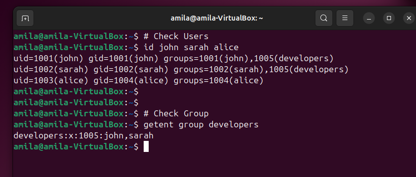
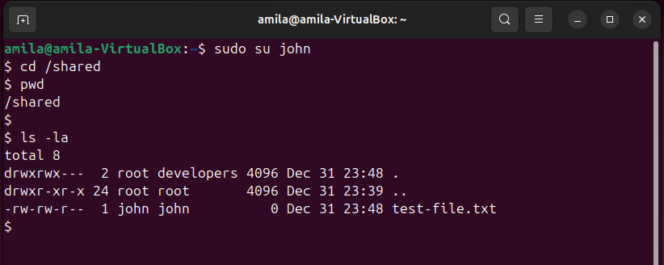

# Lab 01: User & Permission Management

## 🎯 Objective

Learn how to create and manage users, groups, and file permissions in Linux.

## 📋 Prerequisites

- Ubuntu VM running
- Root or sudo access
- Basic command line knowledge

## 🔧 Lab Environment

- **OS**: Ubuntu 22.04 LTS
- **VM**: VirtualBox
- **Time**: 30-45 minutes

## 📝 Task
### Task 1: Create Users and Groups
```bash
# Create two users
sudo useradd -m john
sudo useradd -m sarah

# Set passwords
sudo passwd john
sudo passwd sarah

# Create a group
sudo groupadd developers

# Add users to group
sudo usermod -aG developers john
sudo usermod -aG developers sarah
```

**Verification:**
```bash
# Check users
id john
id sarah

# Check group membership
getent group developers
```

**Screenshot:**


---

### Task 2: Configure Directory Permissions
```bash
# Create shared directory
sudo mkdir /shared
sudo chown root:developers /shared
sudo chmod 770 /shared

# Test permissions
sudo su - john
cd /shared
touch test-file.txt
ls -la
```

**Expected Output:**
```
drwxrwx--- 2 root developers 4096 Dec 31 10:30 /shared
```

**Screenshot:**


---

### Task 3: Practice Permission Modes
```bash
# Create test file
touch testfile.txt

# Try different permissions
chmod 644 testfile.txt  # rw-r--r--
chmod 755 testfile.txt  # rwxr-xr-x
chmod 600 testfile.txt  # rw-------

# Check results
ls -l testfile.txt
```

## 📊 Results

| Task | Status | Notes |
|------|--------|-------|
| User Creation | ✅ | Both users created successfully |
| Group Assignment | ✅ | Users added to developers group |
| Directory Permissions | ✅ | 770 permissions working correctly |
| Permission Testing | ✅ | All modes tested |

## 🐛 Troubleshooting

### Issue: "Permission denied" when creating user
**Solution:**
```bash
# Make sure you're using sudo
sudo useradd -m username
```

### Issue: User can't access shared directory
**Solution:**
```bash
# Verify group membership
groups username

# Re-add to group if needed
sudo usermod -aG developers username

# User must log out and back in for group changes to take effect
```

## 💡 What I Learned

1. **User Management**
   - `useradd` vs `adduser` differences
   - Importance of `-m` flag to create home directory
   - How to set passwords securely

2. **Permission System**
   - Read (4), Write (2), Execute (1) values
   - Owner, Group, Others concept
   - Special permissions like setuid, setgid

3. **Best Practices**
   - Never login as root for daily tasks
   - Use groups for shared access
   - Always test permissions after setting them

## 🔗 Related Scripts

- [`user-setup.sh`](./user-setup.sh) - Automated user creation
- [`check-permissions.sh`](./check-permissions.sh) - Permission audit script

## 📚 Additional Resources

- [Linux File Permissions Explained](https://www.linux.com/training-tutorials/understanding-linux-file-permissions/)
- [User Management Guide](https://www.redhat.com/sysadmin/linux-user-group-management)

## ✅ Lab Completion Checklist

- [x] Created multiple users
- [x] Set up groups
- [x] Configured directory permissions
- [x] Tested access controls
- [x] Documented all steps
- [x] Added screenshots
- [x] Uploaded scripts to GitHub

---

**Completed:** December 31, 2025  
**Next Lab:** [Lab 02 - File System & Storage](../lab02-storage/)
